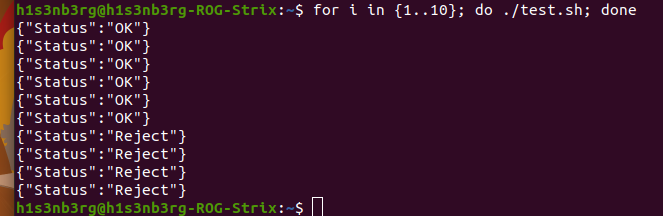

# SystemDesign - RateLimiter
#### _API Rate Limiter implimentation using Flask and Redis_

[]()
[]()

## Installation
Make sure to confiqure application on config.py
Install the dependencies and start the server.

```sh
pip install -r requirements.txt 
python server.py
```

## Output 

